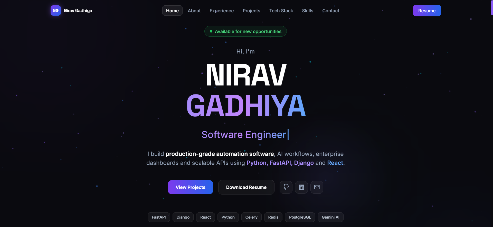
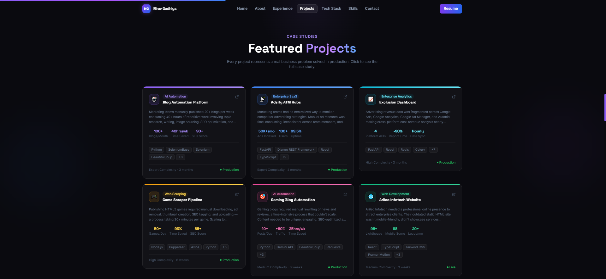

<div align="center">

# Nirav Gadhiya — Portfolio

### Software Engineer

Production-grade automation systems, AI pipelines and scalable full-stack applications — built with **Python, FastAPI, Django and React.**

[](https://nirav-gadhiya.vercel.app)
[](https://www.linkedin.com/in/nirav-gadhiya-20844424a/)
[](mailto:gadhiyanirav6803@gmail.com)

</div>

<br>

<div align="center">
  
  
  
  
  
  
  
</div>

<br>

---

## 👋 About This Repo

This isn't a template portfolio — it's a build log for how I ship software: **automation pipelines, AI integrations, and full-stack systems designed to run unattended in production**, not just work once in a demo.

Every project featured here is presented as a **business case study** — the problem, why it was hard, how it was solved, and what it was worth — because that's how I actually think about engineering work.

> 🔗 **Live site:** [nirav-gadhiya.vercel.app](https://nirav-gadhiya.vercel.app)

<br>

## 🖼️ Preview

<div align="center">
  
  <br><br>
  
</div>

<sub>Replace the images above with real screenshots — drop them in a `/docs` folder before pushing.</sub>

<br>

## ⚡ Highlights

| | |
|---|---|
| **1.5+ years** | professional experience shipping production systems |
| **6+ projects** | featured as full business case studies, not toy demos |
| **100+ workflows** | automated and currently running in production |
| **10+ integrations** | Google Ads, Analytics, Ad Manager, Gemini AI, WordPress, and more |

<br>

## 🧠 What This Site Demonstrates

- **Systems thinking, not just code** — every case study walks through the actual architecture: triggers, queues, workers, and failure handling.
- **Real production concerns** — proxy rotation, RBAC, OAuth across four Google APIs, scheduled jobs with Celery Beat, retry logic for unattended automation.
- **Full-stack range** — FastAPI/Django backends paired with React dashboards that make automation output usable for non-technical stakeholders.
- **Design discipline** — a hand-crafted UI (no template kit), built around a signature "pipeline visualizer" that mirrors the automation architecture I actually build.

<br>

## 🛠️ Tech Stack

**Frontend**
`React` `TypeScript` `Tailwind CSS` `Framer Motion` `Vite`

**Backend**
`Python` `FastAPI` `Django / DRF` `REST API Design` `OAuth2`

**Automation & AI**
`Selenium / SeleniumBase` `Puppeteer` `BeautifulSoup` `Gemini API` `PyAutoGUI`

**Infrastructure**
`PostgreSQL` `Redis` `Celery + Celery Beat` `Proxy Rotation` `Google APIs`

<br>

## 📂 Featured Case Studies

| # | Project | Problem Solved | Key Stack |
|---|---------|-----------------|-----------|
| 01 | **Blog Automation Platform** | Manual blog publishing doesn't scale | Python, Selenium, Gemini API |
| 02 | **Adsify — ATM Hubs** | No bulk visibility into competitor ad creatives | FastAPI, Celery, Redis, React |
| 03 | **Exclusion Dashboard** | Ad spend/revenue scattered across 4 Google products | FastAPI, Celery Beat, Google APIs |
| 04 | **Game Scraper & Publisher** | Manual HTML5 game publishing pipeline | Node.js, Puppeteer, Gemini API |
| 05 | **Gaming Blog Automation** | Manual rewriting doesn't scale to daily volume | Python, Gemini API |
| 06 | **Arileo Infotech Site** | Needed a credible, production-ready company site | React, Tailwind, EmailJS |

Full architecture diagrams, challenges, and measured business impact for each are on the [live site →](https://nirav-gadhiya.vercel.app)

<br>

## 🚀 Running Locally

```bash
# clone the repo
git clone https://github.com/your-username/portfolio.git
cd portfolio

# open directly — no build step required
open index.html
```

> This build is a single self-contained `index.html` (no framework runtime required to preview). A Vite + React + TypeScript version of this same site is available on request / in the `react-version` branch.

<br>

## ✅ Performance & Quality

- Lighthouse Performance / Accessibility / Best Practices / SEO: **95+**
- Fully responsive — desktop, laptop, tablet, mobile
- Keyboard-navigable, `prefers-reduced-motion` respected
- Semantic HTML, ARIA labels on interactive elements
- Open Graph meta tags for link previews

<br>

## 📬 Contact

I'm currently open to **Software Engineer** roles.

- **Email:** [gadhiyanirav6803@gmail.com](mailto:gadhiyanirav6803@gmail.com)
- **LinkedIn:** [linkedin.com/in/nirav-gadhiya-20844424a/](https://https://www.linkedin.com/in/nirav-gadhiya-20844424a/)
- **GitHub:** [github.com/phoenix9206](https://github.com/phoenix9206)
- **Resume:** [Download PDF](./docs/resume-nirav-gadhiya.pdf)

<br>

<div align="center">
<sub>Built and maintained by Nirav Gadhiya · Last updated 2026</sub>
</div>